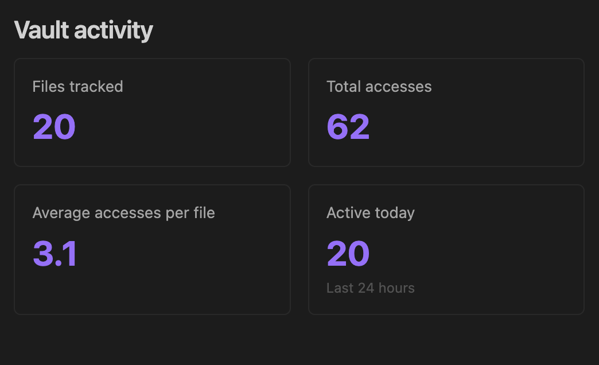

# Vault Activity

Track how often you access notes, Bases, and attachments across your vault to map your overall usage patterns. Use these insights to identify which areas are most active and which files or datasets have been forgotten, guiding cleaner organization and better knowledge retention.

## Features

- **Automatic tracking** of file access and modifications
- **Activity dashboard** showing most/least viewed notes
- **Smart filtering** with folder exclusions
- **Random neglected note** command to rediscover forgotten content
- **Markdown reports** with activity summaries

## Commands

- `Open activity dashboard` - View real-time activity stats
- `Show most viewed notes` - Top 20 most opened files
- `Show least viewed notes` - Bottom 20 least opened files
- `Open random neglected note` - Discover forgotten content
- `Generate activity report` - Create markdown summary
- `Clear all activity data` - Reset tracking

## Usage

The plugin automatically tracks your vault activity unless disabled. Open the dashboard from the command palette to view insights.

### Settings

- Toggle tracking for access/modifications
- Exclude folders (e.g., templates, attachments)
- View statistics and manage data

### Data Storage

Activity data is stored locally in `.obsidian/plugins/vault-activity/data.json`

## License

GPL-3.0

